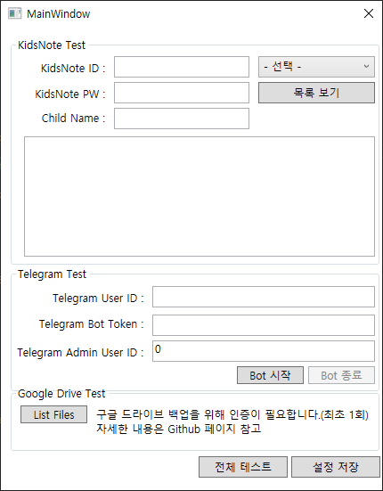
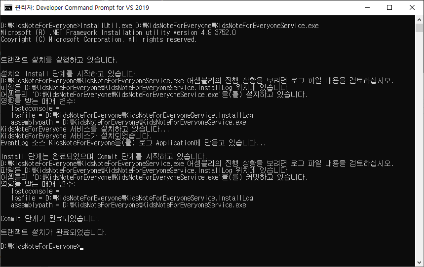
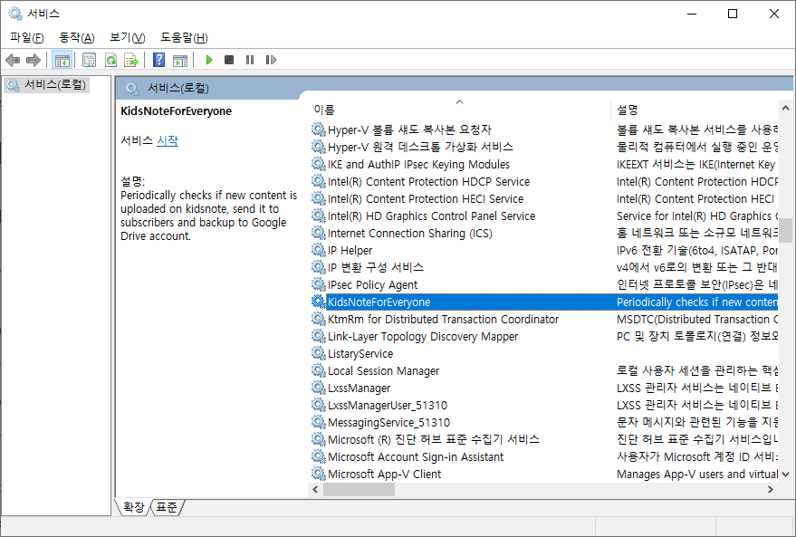
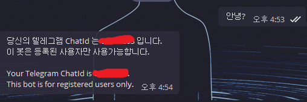

# 모두의 키즈노트

모두의 키즈노트는 텔레그램을 통하여 키즈노트의 알림을 받을 수 있도록 개발된 [텔레그램](https://telegram.org/) [봇](https://core.telegram.org/bots) 입니다.

키즈노트 앱을 사용하면 키즈노트의 유용한 기능들을 손쉽게 사용할 수 있지만, 계정을 두 개 이상 사용해야 하는 경우 번갈아가며 로그인을 해야 하는 불편함이 있습니다.

예를 들어, 할머니 할아버지가 첫째 아들의 손주와 둘째 딸의 손주의 키즈노트를 하나의 계정으로 보는 것이 불가능합니다. 개발자인 저의 경우가 그렇습니다. 이미 부모님 폰의 키즈노트 앱에는 연결된 계정이 존재합니다. 할아버지, 할머니가 각각 다른 계정을 등록하여 사용하는 방법이 일반적이지만, KidsNoteNotifier 를 개발하여 새로운 옵션과 부가 기능을 제공하게 되었습니다.

이 문서는 일반적인 사용자가 아닌 소프트웨어 개발에 어느 정도 경험과 지식이 있는 분들이 아니면 이해에 어려움이 있을 수 있습니다.


## 주요기능

### 푸시 알림기능

키즈노트에 새로운 게시물이 올라온 경우, 한 시간 이내에 게시물의 내용을 텔레그램 메시지로 전송합니다. 전송된 메시지는 사용자의 기기에도 저장되고 텔레그램 서버에도 저장됩니다.

### 아카이브 기능

키즈노트에 올라온 자녀의 데이터를 구글 드라이브에 아카이브 할 수 있습니다. 구글 계정이 있어야 하며 구글 드라이브에 충분한 여유공간이 있어야 합니다. 암호화(ChaCha)하여 아카이브 하는 기능도 제공합니다. '이 기능은 아직 구글 드라이브 API 인증을 받지 못해서 구현하지 못하고 있습니다)

### 오동작 알림

모두의 키즈노트는 웹사이트에 로그인하여 페이지에서 데이터를 추출하여 텔레그램으로 전송합니다. 웹사이트의 구조나 형식이 달라지는 경우 데이터가 추출되지 않을 수 있습니다. 이 경우, 대표사용자에게 오동작 알림 메시지가 전송됩니다. 오동작이 감지되면, 최신 소스로 업데이트 후 다시 빌드하여야 합니다. 당신이 개발자라면, 직접 기여하시는 것도 좋은 방법이 될 것입니다.


## 설치 & 사용방법

모두의 키즈노트는 항상 구동되고 있는 기기에 설치되어야 메시지를 제대로 받을 수 있습니다. PC에 설치하여도 되지만, 라즈베리파이 같은 기기에 설치해서 전기세 낭비를 줄일 수 있습니다. 사용중이신 클라우드 서비스가 있다면 그곳에 설치하여도 됩니다.

### 설치방법

윈도우 및 리눅스 기반 시스템에 설치할 수 있습니다.


#### 텔레그램 봇 만들기
당신의 자녀만을 위한 모두의 키즈노트를 구동시키기 위해서 텔레그램 봇을 만들어야 합니다. [이 문서](https://core.telegram.org/bots#3-how-do-i-create-a-bot) 를 참고하세요. 당신이 개발자라면 운영용 봇과 개발용 봇을 만드는 것을 권장합니다.


#### (필수) 모두의 키즈노트 빌드하기
Visual Studio 를 권장합니다. 개인 사용자의 경우, [Visual Studio Community](https://visualstudio.microsoft.com/ko/downloads/) 을 무료로 설치할 수 있습니다. 사티아 나델라 (Satya Nadella) 에게 깊은 경의를 표합니다.

#### 윈도우에 모두의 키즈노트 서비스 설치
아직 인스톨러를 제공하고 있지 않습니다. 직접 빌드도구를 사용하여 빌드하고 직접 서비스로 등록하여야 합니다.

1. 소스코드를 내려받고, Visual Studio 또는 다른 빌드도구를 이용하여 모두의 키즈노트를 빌드하세요. 실제로 배포(설치)될 바이너리를 생성하여야 하므로 Release 모드로 빌드합니다.
2. 프로젝트 출력경로에 생성된 모든 파일을 대상경로에 복사하세요. 여기서는 D:\KidsNoteForEveryone 를 예로 들어 설명합니다.
3. Developer Command Prompt for VS201X 를 관리자 모드로 실행하세요.
4. 프롬프트 상에서 D:\KidsNoteForEveryone 폴더로 이동합니다.
5. 이제 설정파일을 작성하여야 합니다. 탐색기에서 D:\KidsNoteForEveryone 폴더에 있는 Tester.exe 파일을 실행하면 간단한 동작 확인 및 설정파일 작성이 가능합니다.\

6. 키즈노트 계정을 입력합니다. KidsNoteId, KidsNotePW 에 키즈노트 ID/PW 를 입력하고 "-선택-" 항목에서 "알림장" 을 선택한 후에 "목록보기" 버튼을 눌러 키즈노트의 게시물이 로드되는지 확인하여보세요.
7. 텔레그램 봇의 일반 사용자 ID 및 관리자 ID 를 지정하여야 합니다. [대화 ID 설정파일에 추가하기] 를 참고하세요.
8. Tester.exe 를 가지고 모든 설정을 저장합니다. Tester.exe 도 종료합니다.
9. 과정 3에서 실행한 프롬프트 창에서 다음과 같이 입력합니다.\
```
InstallUtil.exe D:\KidsNoteForEveryone\KidsNoteForEveryoneService.exe
```
10. 다음과 같이 성공하는지 확인합니다.\

11. 윈도우+R 키를 눌러 services.msc 를 입력한 후, 서비스 목록에 KidsNoteForEveryone 이 목록에 있는지 확인하여 보세요.

12. 항목을 더블클릭하여 시작 유형을 원하는 설정으로 변경하고, 서비스를 시작합니다.

#### 리눅스에 모두의 키즈노트 데몬 설치
##### Mono 설치하기
각 배포본의 패키지 관리자를 통하여 mono-devel 패키지와 mono-4.0-service 를 설치합니다. 배포본에 따라 패키지 이름이 다를 수 있습니다. 여기서는 데비안 계열 (Debian, Raspbian, Ubuntu, ...) 기준으로 설명합니다.

##### 데몬으로 등록하기
1. [윈도우에 모두의 키즈노트 서비스 설치] 의 과정 1을 거쳐 모드의 키즈노트를 빌드하세요.
2. 리눅스 계정의 홈 디렉토리에 knfe 라는 하위 디렉토리를 만들고 그 안에 Release 폴더에 빌드된 모든 파일을 복사합니다.
3. 소스코드에 있는 knfe.sh 를 열어서 RUN_DIR 변수를 단계 2에서 만든 디렉토리의 절대경로로 수정합니다.
4. knfe.sh 를 /etc/init.d 에 복사하시고 실행권한을 755로 변경하신 후, 다음 명령을 입력하세요.
```
pi@raspberrypi:/etc/init.d $ sudo update-rc.d knfe.sh defaults
```
5. 위와 같이 하면 데몬으로 등록되고 부팅시마다 실행됩니다. 만약 부팅시에 실행이 안되면 설치 디렉토리에 service.lock 파일이 있는지 확인하여보세요. 데몬이 비정상 종료되면 service.lock 이 삭제되지 않는데, knfe 는 실행시에 service.lock 파일이 존재하면 데몬이 이미 실행중이라 판단하고 데몬을 띄우지 않습니다.
6. 데몬 종료와 시작은 다음 명령으로 해주세요. 프로그램 업데이트시에 데몬을 종료하고, 파일을 덮어쓰신 후, 데몬을 시작하시면 됩니다.
```
/etc/init.d/knfe.sh stop   # 데몬종료
/etc/init.d/knfe.sh start  # 데몬시작
```

#### 라즈베리파이에 모두의 키즈노트 데몬 설치
##### Mono 설치하기
Raspbian 기준으로 설명합니다. Raspbian 의 패키지 저장소에 있는 mono 는 최신 버전이 아닙니다. [모노 프로젝트 다운로드 페이지](https://www.mono-project.com/download/stable/#download-lin) 에 안내된 대로 별도 저장소를 추가하여 패키지를 설치하세요. PC 에서와 마찬가지로 mono-4.0-service 패키지도 설치합니다.

##### 데몬으로 등록하기
PC 리눅스와 동일합니다. 해당 항목을 참조하세요.

### 사용방법
#### 나의 대화 ID 알아내기 & 설정파일에 추가하기

모두의 키즈노트로 알림을 받기 위해서는 텔레그램 설정도 해야 합니다. 우선 모두의 키즈노트가 실행중인 상태라면 종료하세요.

1. [윈도우에 모두의 키즈노트 서비스 설치]에 설명된 Tester.exe 를 실행하세요.
2. [텔레그램 봇 만들기] 에서 생성한 API Key 를 Telegram Bot Token 란에 입력하세요.
3. "Bot 시작" 버튼을 누르면 텔레그램 봇이 시작됩니다. (봇은 동일한 API Key 를 가지고 한 개만 구동됩니다. 동시에 여러번 실행하면 오동작 합니다)
4. [텔레그램 봇 만들기] 에서 만든 텔레그램 봇을 친구추가하시고 대화를 시작하여 보세요. 어떤 메시지를 입력하여도 봇은 같은 대답을 합니다.\

5. 텔레그램이 알려준 당신의 Id 를 Telegram Admin User ID 란에 입력하세요. 모두의 키즈노트는 입력한 Id 를 관리자 아이디로 인식하고 해당 아이디에 관리 메시지(오류 및 이상상태 감지)를 발송합니다.
6. 부모님 휴대폰에도 텔레그램을 설치하시고 과정 4를 반복하세요. 부모님의 텔레그램 Id 는 Telegram User ID 란에 입력하세요. Id 는 여러개 등록할 수 있습니다. 콤마(,)로 구분하여 여러 아이디를 입력하시면 됩니다.
7. 관리자 Id 및 일반 사용자 목록을 모두 입력하셨다면 설정 저장 버튼을 누르세요.
8. 설정이 완료되었으면 "Bot 종료"를 누르시고 Tester.exe 도 종료합니다.

#### 구글 드라이브 등록하기 (선택사항)


## 보안

원활한 동작을 위하여 키즈노트 계정의 아이디와 비밀번호는 설정파일에 저장되어 있어야 합니다. 구글 드라이브 아카이브 기능을 사용하는 경우, 구글드라이브의 인증정보도 설정파일에 저장되어야 합니다. 이러한 정보들은 평문으로 저장하지 않고 암호화(AES256 CBC)하여 저장하지만, KidsNoteNotifier 는 오픈소스로 공개되어 있으므로 암호화 키와 초기화 벡터를 소스코드에 있는 값이 아닌 다른 값으로 변경하셔서 사용하는 것을 추천합니다.


## 자주 묻는 질문

### 아이가 둘인 경우 어떻게 하나요?
아직 첫 아이만 있어서 키즈노트의 아동 등록이 어떻게 되어 있는지 알지 못하고 있는 상태입니다. 오픈소스로 공개하고 있으니 함께 만들어 보아요.
